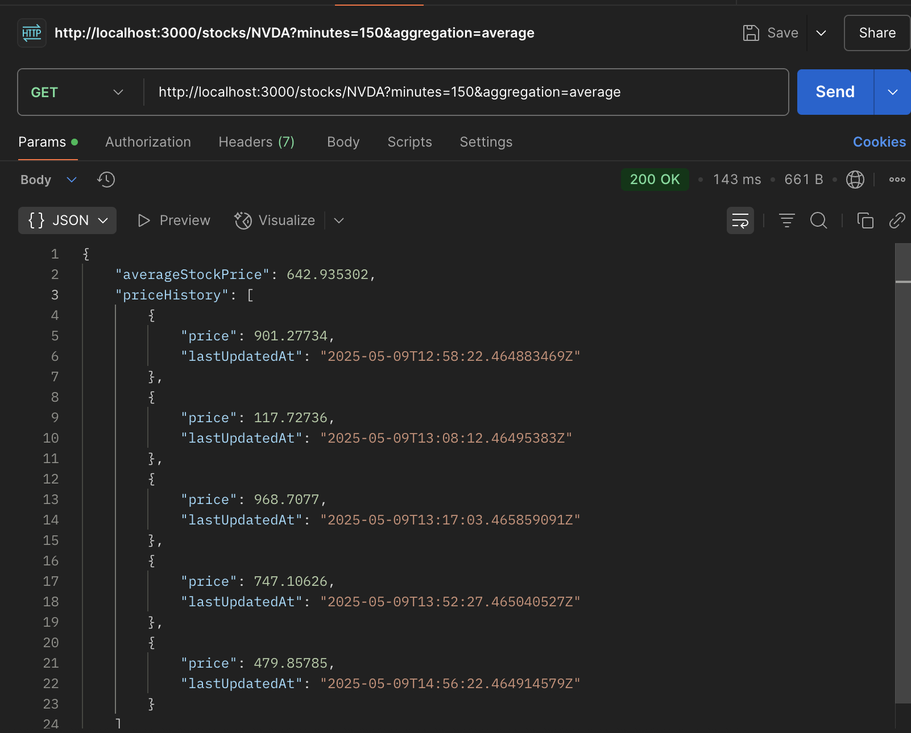
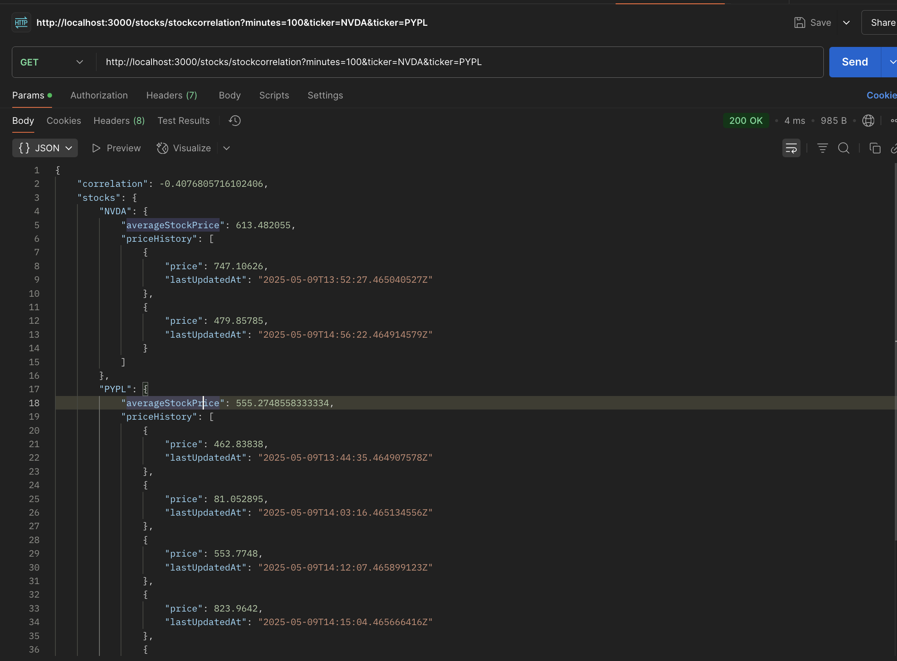

## Stock Price Aggregation API

This folder contains the submission for **Question 1** of the assignment, implementing a stock price aggregation and correlation microservice using Node.js and Express.

---

### 🛠 Tech Stack

- **Runtime:** Node.js
- **Framework:** Express.js
- **Language:** JavaScript (ES Modules)
- **Data Source:** Test Server (via HTTP requests)
- **API Client for Testing:** Postman
- **Dependencies:** None for algorithmic computation (no external libraries used for average/correlation)

---


### 📦 Installation & Running the Server

1. Clone the repository and navigate to this folder:

   ```bash
   git clone https://github.com/alokvns48/2200290130028.git
   cd your-roll-number/Question_1
   ```

2. Install dependencies:

   ```bash
   npm install
   ```

3. Create a `.env` file (if needed for the bearer token):

   ```env
   BEARER_TOKEN=your_token_here
   ```

4. Start the server:

   ```bash
   npm run dev
   ```

---

### 📡 Available Endpoints

| Method | Endpoint                            | Description                               |
|--------|-------------------------------------|-------------------------------------------|
| GET    | `/stocks/:ticker?minutes=30`        | Get average price for given ticker        |
| GET    | `/stocks/stockcorrelation?...`      | Get correlation between two tickers       |


---

### 📷 Screenshots

- Postman screenshots for:
  - Average price endpoint
  

  - Correlation endpoint
  

Screenshots are included in the `screenshot/` folder.

